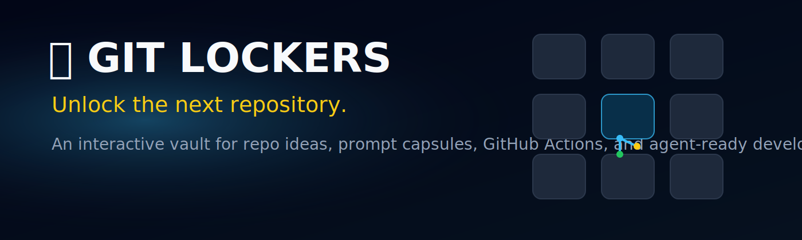
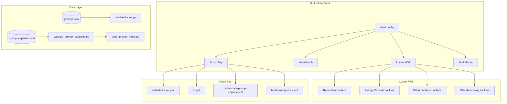
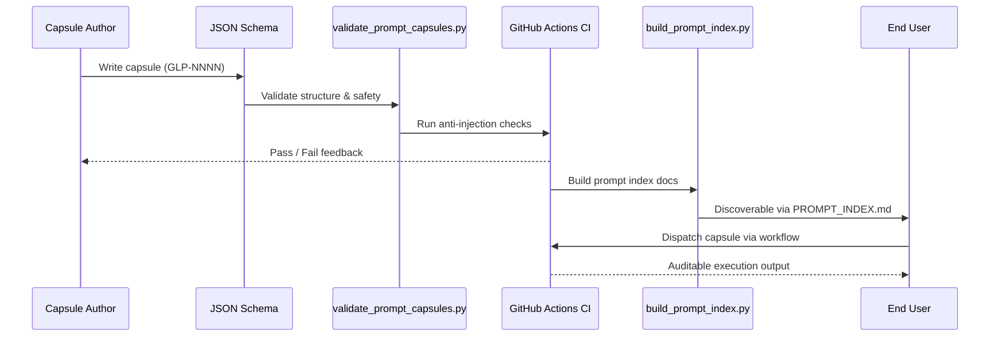
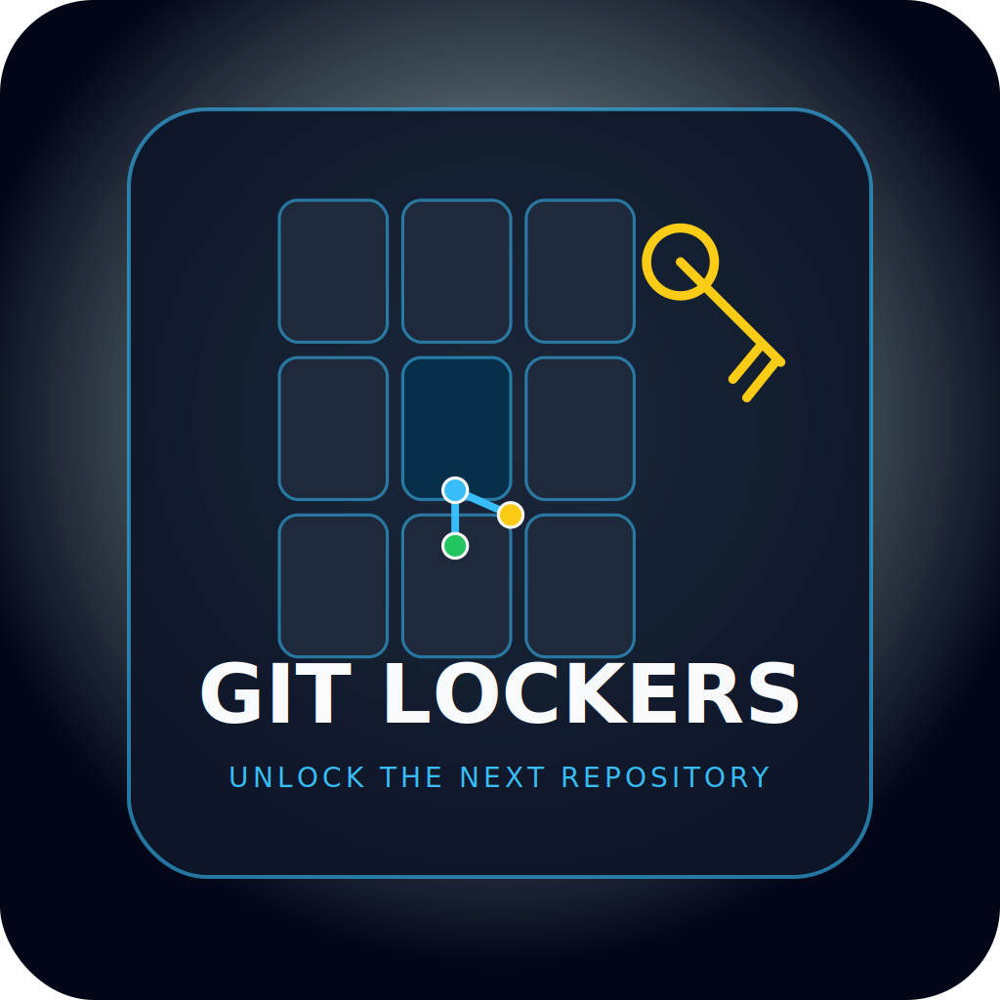

<div align="center">


<br/>



<br/>


<br/>

<a href="https://github.com/DeontewattsV1/Git-Locker-/actions/workflows/validate-locker.yml"></a>
<a href="https://github.com/DeontewattsV1/Git-Locker-/actions/workflows/ci.yml"></a>
<a href="./LICENSE"></a>
<a href="https://sonarcloud.io/dashboard?id=DeontewattsV1_Git-Locker-"></a>

<br/>


<br/><br/>

<strong>Git Lockers is an interactive open-source environment for storing, exploring,<br/>
validating, and activating reusable GitHub ideas, prompt capsules, workflows,<br/>
repository concepts, and agent-ready build systems.</strong>

</div>

---

## Table of Contents

- [Overview](#overview)
- [Quickstart](#quickstart)
- [Core Concepts](#core-concepts)
- [Repository Structure](#repository-structure)
- [Configuration](#configuration)
- [Usage](#usage)
- [Architecture](#architecture)
- [Development](#development)
- [Prompt Capsules](#prompt-capsules)
- [Deployment](#deployment)
- [Troubleshooting](#troubleshooting)
- [Quick Stats](#quick-stats)
- [Related Projects](#related-projects)
- [Contributing](#contributing)
- [Support](#support)
- [License](#license)

---

## Overview

Git Lockers is a **developer vault**. Each locker contains a repo idea, prompt
capsule, GitHub Action, README pattern, launch kit, schema, agent role, or
workflow recipe.

A user does not just browse files. They **unlock** lockers, inspect them,
validate them, fork them, and build from them.

### What's Inside
<h1 align="center">Git Lockers</h1>

<p align="center">
  <strong>Unlock the next repository.</strong>
</p>

<p align="center">
  <a href="https://github.com/DeontewattsV1/Git-Locker-/actions/workflows/validate-locker.yml"></a>
  <a href="https://github.com/DeontewattsV1/Git-Locker-/actions/workflows/ci.yml"></a>
  <a href="./LICENSE"></a>
</p>

<p align="center">
  Git Lockers is an interactive open-source environment for storing, exploring,<br>
  validating, and activating reusable GitHub ideas, prompt capsules, workflows,<br>
  repository concepts, and agent-ready build systems.
</p>

---

## Table of Contents

- [Overview](#overview)
- [Quickstart](#quickstart)
- [Core Concepts](#core-concepts)
- [Repository Structure](#repository-structure)
- [Configuration](#configuration)
- [Usage](#usage)
- [Architecture](#architecture)
- [Development](#development)
- [Prompt Capsules](#prompt-capsules)
- [Deployment](#deployment)
- [Troubleshooting](#troubleshooting)
- [Contributing](#contributing)
- [Support](#support)
- [License](#license)

---

## Overview

Git Lockers is a **developer vault**. Each locker contains a repo idea, prompt
capsule, GitHub Action, README pattern, launch kit, schema, agent role, or
workflow recipe.

A user does not just browse files. They **unlock** lockers, inspect them,
validate them, fork them, and build from them.

### What's Inside

| System | Purpose |
|---|---|
| **Git Locker** | 1,000 foundational GitHub repository concept seeds |
| **Prompt Capsules** | 1,000 controlled `/inject` workflow prompts for expert/agentic usage |
| **Mise PR** | Review-readiness layer for pull requests |
| **Augmented Repository Grid** | Structured spreadsheet/database/RAG workspace |
| **JEAI Integration** | Auditable reasoning stack with dissent, preference, action, and audit roles |
| **Git Lockers Brand** | Interactive developer vault identity and visual system |

---

## Quickstart

**Prerequisites**

- Git 2.30+
- Python 3.10+ (for validation scripts)
- No external services required

**Setup**

```bash
$ git clone https://github.com/DeontewattsV1/Git-Locker-.git
$ cd Git-Locker-
```

**Validate locker data**

```bash
$ python3 scripts/validate-locker.py
```

**Validate prompt capsules**

```bash
$ python3 scripts/validate_prompt_capsules.py
```

**Build prompt index**

```bash
$ python3 scripts/build_prompt_index.py
```

---

## Core Concepts

| Concept | Meaning |
|---|---|
q| **Git Locker** | 1,000 foundational GitHub repository concept seeds |
| **Prompt Capsules** | 1,000 controlled `/inject` workflow prompts for expert/agentic usage |
| **Mise PR** | Review-readiness layer for pull requests |
| **Augmented Repository Grid** | Structured spreadsheet/database/RAG workspace |
| **JEAI Integration** | Auditable reasoning stack with dissent, preference, action, and audit roles |
| **Git Lockers Brand** | Interactive developer vault identity and visual system |

---

## Quickstart

**Prerequisites**

- Git 2.30+
- Python 3.10+ (for validation scripts)
- No external services required

**Setup**

```bash
$ git clone https://github.com/DeontewattsV1/Git-Locker-.git
$ cd Git-Locker-
```

**Validate locker data**

```bash
$ python3 scripts/validate-locker.py
```

**Validate prompt capsules**

```bash
$ python3 scripts/validate_prompt_capsules.py
```

**Build prompt index**

```bash
$ python3 scripts/build_prompt_index.py
```

---

## Core Concepts

| Concept | Meaning |
|---|---|
| **Locker** | One reusable build seed, workflow, prompt, or repository primitive |
| **Key** | A command, prompt, trigger, or GitHub Action that unlocks a workflow |
| **Vault** | A category collection of lockers |
| **Capsule** | A structured prompt or workflow instruction |
| **Workbench** | Area for generating, configuring, validating, and exporting lockers |
| **Action Bay** | GitHub Actions automation center |
| **Audit Room** | Safety, validation, citations, and policy checks |
| **Launch Door** | Product Hunt, GitHub release, or public publishing path |

---

<details>
<summary><strong>Repository Structure</strong></summary>

<br/>

```text
Git-Locker-/
├── assets/                          # Brand assets (logo, hero, social preview)
├── data/
│   ├── git-locker.csv               # 1,000 repo seeds (structured CSV)
│   └── git-locker.json              # Same data in JSON format
├── prompt-capsules/
│   ├── prompt-capsules.json         # 1,000 controlled /inject capsules
│   ├── prompt-capsules.csv          # CSV format
│   ├── PROMPT_CAPSULES.md           # Human-readable capsule docs
│   └── by-category/                 # Category-specific capsule docs
├── schema/
│   ├── git-locker.schema.json       # JSON Schema for locker entries
│   └── prompt-capsule.schema.json   # JSON Schema for prompt capsules
├── scripts/
│   ├── validate-locker.py           # Locker CSV validator
│   ├── validate_prompt_capsules.py  # Prompt capsule validator
│   ├── build_prompt_index.py        # Generates prompt index docs
│   ├── list_workflows.py            # Lists available workflows
│   └── enable_workflows.sh          # Enables disabled GitHub Actions
├── templates/
│   └── new-locker-item.md           # Template for new locker proposals
├── docs/
│   ├── BRAND_IDENTITY.md            # Visual and verbal brand guide
│   ├── ROADMAP.md                   # Development phases
│   ├── ARTIFACT_INDEX.md            # Generated artifact registry
│   ├── PRIVACY_REDACTIONS.md        # Redaction policy
│   ├── evaluation.md                # Capsule system evaluation
│   ├── github-actions.md            # Actions integration guide
│   └── PROMPT_INDEX.md              # Auto-generated capsule index
├── examples/
│   └── repository-dispatch-payload.json
├── .github/
│   ├── workflows/
│   │   ├── validate-locker.yml      # Locker validation CI
│   │   ├── ci.yml                   # Prompt capsule CI
│   │   ├── orchestrate-prompt-capsule.yml
│   │   ├── enable-all-workflows.yml
│   │   └── build-prompt-docs.yml
│   ├── ISSUE_TEMPLATE/
│   │   ├── new-locker-item.yml      # New locker item form
│   │   └── prompt-capsule-request.yml
│   ├── PULL_REQUEST_TEMPLATE.md
│   └── dependabot.yml
├── LOCKER.md                        # Full locker index (1,000 entries)
├── CHAT_HISTORY.md                  # Public-safe development ledger
├── CONTRIBUTING.md                  # Contribution guide
├── CODE_OF_CONDUCT.md               # Community standards
├── CLAUDE.md                        # Agent behavior guide
├── LICENSE                          # Boost Software License 1.0
└── README.md                        # You are here
```

</details>

---

## Configuration

Git Lockers is a static data repository. No environment variables or secrets
are required to browse, validate, or extend the locker.

| Setting | Default | Description |
|---|---|---|
| Python version | 3.10+ | Required for validation scripts |
| CSV field order | Fixed | See `schema/git-locker.schema.json` |
| Capsule ID format | `GLP-NNNN` | Four-digit zero-padded |
| Risk levels | low / medium / high | Per capsule safety classification |

### GitHub Actions Permissions

All workflows use least-privilege defaults:

```yaml
permissions:
  contents: read
```

The `enable-all-workflows.yml` action additionally requires `actions: write`.

---

## Usage

### Browse Locker Entries

Open [`LOCKER.md`](./LOCKER.md) to browse 1,000 repository seed concepts, or
query the structured data:

```bash
# Search by domain
$ grep "Agentic Infrastructure" data/git-locker.csv

# Count entries by domain
$ cut -d',' -f3 data/git-locker.csv | sort | uniq -c | sort -rn | head
```

### Use a Prompt Capsule

Each capsule follows the `/inject` pattern:

```bash
# Validate all capsules
$ python3 scripts/validate_prompt_capsules.py

# Find a capsule by category
$ python3 -c "
import json
data = json.load(open('prompt-capsules/prompt-capsules.json'))
for c in data[:5]:
    print(f\"{c['id']} — {c['command']} — {c['category']}\")
"
```

### Trigger via GitHub Actions

```bash
# Dispatch a prompt capsule workflow
$ gh api repos/DeontewattsV1/Git-Locker-/dispatches \
    -f event_type=prompt-capsule \
    -f 'client_payload[capsule_id]=GLP-0001' \
    -f 'client_payload[dry_run]=true'
```

Or use the manual workflow dispatch in the GitHub Actions tab with any
`capsule_id` (e.g., `GLP-0001`).

---

## Architecture



### Prompt Capsule Lifecycle



### Key Components

- **Data Layer** — CSV/JSON stores validated by Python scripts and JSON Schema
- **Prompt Engine** — 1,000 capsules with safety gates, audit contracts, and
  workflow hooks
- **CI/CD** — GitHub Actions validate on every push and PR
- **Brand System** — Consistent visual identity across all surfaces

---

## Development

### Install and Validate

```bash
$ git clone https://github.com/DeontewattsV1/Git-Locker-.git
$ cd Git-Locker-
$ python3 scripts/validate-locker.py
$ python3 scripts/validate_prompt_capsules.py
```

### Add a New Locker Entry

1. Add a row to `data/git-locker.csv`
2. Add the same item to `data/git-locker.json`
3. Run validation:

```bash
$ python3 scripts/validate-locker.py
```

4. Open a pull request

### Add a New Prompt Capsule

1. Add an entry to `prompt-capsules/prompt-capsules.json`
2. Add the same row to `prompt-capsules/prompt-capsules.csv`
3. Validate:

```bash
$ python3 scripts/validate_prompt_capsules.py
```

| **Locker** | One reusable build seed, workflow, prompt, or repository primitive |
| **Key** | A command, prompt, trigger, or GitHub Action that unlocks a workflow |
| **Vault** | A category collection of lockers |
| **Capsule** | A structured prompt or workflow instruction |
| **Workbench** | Area for generating, configuring, validating, and exporting lockers |
| **Action Bay** | GitHub Actions automation center |
| **Audit Room** | Safety, validation, citations, and policy checks |
| **Launch Door** | Product Hunt, GitHub release, or public publishing path |

---

## Repository Structure

```text
Git-Locker-/
├── assets/                          # Brand assets (logo, hero, social preview)
├── data/
│   ├── git-locker.csv               # 1,000 repo seeds (structured CSV)
│   └── git-locker.json              # Same data in JSON format
├── prompt-capsules/
│   ├── prompt-capsules.json         # 1,000 controlled /inject capsules
│   ├── prompt-capsules.csv          # CSV format
│   ├── PROMPT_CAPSULES.md           # Human-readable capsule docs
│   └── by-category/                 # Category-specific capsule docs
├── schema/
│   ├── git-locker.schema.json       # JSON Schema for locker entries
│   └── prompt-capsule.schema.json   # JSON Schema for prompt capsules
├── scripts/
│   ├── validate-locker.py           # Locker CSV validator
│   ├── validate_prompt_capsules.py  # Prompt capsule validator
│   ├── build_prompt_index.py        # Generates prompt index docs
│   ├── list_workflows.py            # Lists available workflows
│   └── enable_workflows.sh          # Enables disabled GitHub Actions
├── templates/
│   └── new-locker-item.md           # Template for new locker proposals
├── docs/
│   ├── BRAND_IDENTITY.md            # Visual and verbal brand guide
│   ├── ROADMAP.md                   # Development phases
│   ├── ARTIFACT_INDEX.md            # Generated artifact registry
│   ├── PRIVACY_REDACTIONS.md        # Redaction policy
│   ├── evaluation.md                # Capsule system evaluation
│   ├── github-actions.md            # Actions integration guide
│   └── PROMPT_INDEX.md              # Auto-generated capsule index
├── examples/
│   └── repository-dispatch-payload.json
├── .github/
│   ├── workflows/
│   │   ├── validate-locker.yml      # Locker validation CI
│   │   ├── ci.yml                   # Prompt capsule CI
│   │   ├── orchestrate-prompt-capsule.yml
│   │   ├── enable-all-workflows.yml
│   │   └── build-prompt-docs.yml
│   ├── ISSUE_TEMPLATE/
│   │   ├── new-locker-item.yml      # New locker item form
│   │   └── prompt-capsule-request.yml
│   ├── PULL_REQUEST_TEMPLATE.md
│   └── dependabot.yml
├── LOCKER.md                        # Full locker index (1,000 entries)
├── CHAT_HISTORY.md                  # Public-safe development ledger
├── CONTRIBUTING.md                  # Contribution guide
├── CODE_OF_CONDUCT.md               # Community standards
├── CLAUDE.md                        # Agent behavior guide
├── LICENSE                          # Boost Software License 1.0
└── README.md                        # You are here
```

---

## Configuration

Git Lockers is a static data repository. No environment variables or secrets
are required to browse, validate, or extend the locker.

| Setting | Default | Description |
|---|---|---|
| Python version | 3.10+ | Required for validation scripts |
| CSV field order | Fixed | See `schema/git-locker.schema.json` |
| Capsule ID format | `GLP-NNNN` | Four-digit zero-padded |
| Risk levels | low / medium / high | Per capsule safety classification |

### GitHub Actions Permissions

All workflows use least-privilege defaults:

```yaml
permissions:
  contents: read
```

The `enable-all-workflows.yml` action additionally requires `actions: write`.

---

## Usage

### Browse Locker Entries

Open [`LOCKER.md`](./LOCKER.md) to browse 1,000 repository seed concepts, or
query the structured data:

```bash
# Search by domain
$ grep "Agentic Infrastructure" data/git-locker.csv

# Count entries by domain
$ cut -d',' -f3 data/git-locker.csv | sort | uniq -c | sort -rn | head
```

### Use a Prompt Capsule

Each capsule follows the `/inject` pattern:

```bash
# Validate all capsules
$ python3 scripts/validate_prompt_capsules.py

# Find a capsule by category
$ python3 -c "
import json
data = json.load(open('prompt-capsules/prompt-capsules.json'))
for c in data[:5]:
    print(f\"{c['id']} — {c['command']} — {c['category']}\")
"
```

### Trigger via GitHub Actions

```bash
# Dispatch a prompt capsule workflow
$ gh api repos/DeontewattsV1/Git-Locker-/dispatches \
    -f event_type=prompt-capsule \
    -f 'client_payload[capsule_id]=GLP-0001' \
    -f 'client_payload[dry_run]=true'
```

Or use the manual workflow dispatch in the GitHub Actions tab with any
`capsule_id` (e.g., `GLP-0001`).

---

## Architecture


### Key Components

- **Data Layer** — CSV/JSON stores validated by Python scripts and JSON Schema
- **Prompt Engine** — 1,000 capsules with safety gates, audit contracts, and
  workflow hooks
- **CI/CD** — GitHub Actions validate on every push and PR
- **Brand System** — Consistent visual identity across all surfaces

---

## Development

### Install and Validate

```bash
$ git clone https://github.com/DeontewattsV1/Git-Locker-.git
$ cd Git-Locker-
$ python3 scripts/validate-locker.py
$ python3 scripts/validate_prompt_capsules.py
```

### Add a New Locker Entry

1. Add a row to `data/git-locker.csv`
2. Add the same item to `data/git-locker.json`
3. Run validation:

```bash
$ python3 scripts/validate-locker.py
```

4. Open a pull request

### Add a New Prompt Capsule

1. Add an entry to `prompt-capsules/prompt-capsules.json`
2. Add the same row to `prompt-capsules/prompt-capsules.csv`
3. Validate:

```bash
$ python3 scripts/validate_prompt_capsules.py
```

4. Rebuild the index:

```bash
$ python3 scripts/build_prompt_index.py
```

### Schema Validation

Locker entries must conform to `schema/git-locker.schema.json`:

- `repo_name`: lowercase, hyphenated (`^[a-z0-9][a-z0-9-]+[a-z0-9]$`)
- `status`: one of `open-seed-unverified`, `research-needed`, `validated-name`,
  `claimed`, `built`, `deprecated`

Prompt capsules must conform to `schema/prompt-capsule.schema.json`:

- `id`: format `GLP-NNNN`
- `command`: format `/inject category.operation`
- `risk`: one of `low`, `medium`, `high`
- `prompt`: minimum 300 characters

---

## Prompt Capsules

The prompt capsule system provides **1,000 controlled `/inject` commands** for
expert GitHub, JEAI, Mise PR, and agentic workflow usage.

### Categories

| Category | Focus |
|---|---|
| Mise PR | Review-readiness for pull requests |
| Git Locker | Repository seed management |
| Augmented Grid | Structured data workspace |
| JEAI | Judgment-enhanced AI reasoning |
| MDM Agency | Multi-agent orchestration |
| GitHub Actions | Workflow automation |
| Repo Governance | Repository policy and compliance |
| Agentic Coding | AI-assisted development |
| Security Aegis | Security posture management |
| Data Lineage | Data flow tracking |
| Developer Experience | DX improvements |
| API Platform | API design and management |
| CI Quality | Continuous integration quality |

### Safety Model

Every capsule includes:

- **Operating model**: Human conductor → MDM Orchestrator → Specialist Agent
- **Safety gate**: No credential disclosure, no access control weakening
- **Output contract**: Structured, auditable output format
- **GitHub Actions hook**: Workflow dispatch integration

### Anti-Injection Controls

The validation script checks for dangerous patterns:

- Attempts to ignore previous/system instructions
- Requests to reveal secrets or tokens
- Attempts to bypass authentication or safety
- Exfiltration patterns

---

## Deployment

Git Lockers is a static repository. No server deployment is required.

**GitHub Pages** can serve the docs and brand assets:

```yaml
# Enable in repo Settings → Pages → Deploy from branch (main, /docs)
```

**Social Preview**: Upload `assets/git-lockers-social-preview-1280x640.png`
via Settings → General → Social Preview.

---

<details>
<summary><strong>Troubleshooting</strong></summary>

<br/>

| Symptom | Cause | Fix |
|---|---|---|
| `validate-locker.py` fails | Missing or malformed CSV field | Check field order matches schema |
| Duplicate repo name error | Name already exists in CSV | Choose a unique name |
| Prompt validation fails | Prompt < 300 chars or bad ID format | Check `GLP-NNNN` pattern |
| Workflow not triggering | Workflow disabled by GitHub | Run `enable-all-workflows.yml` |
| CSV encoding issues | Non-UTF-8 characters | Save as UTF-8 without BOM |

</details>

---

## Quick Stats

<div align="center">


<br/>


</div>

---

## Related Projects

<div align="center">

<a href="https://github.com/DeontewattsV1/Harmonic-Visual-Environment-Journal-and-HIMM"></a>
<a href="https://github.com/DeontewattsV1/The-Architects-Signal"></a>
<a href="https://github.com/DeontewattsV1/Wildfire-The-Architecture-of-Surrender"></a>

</div>

---

## Contributing

See [CONTRIBUTING.md](./CONTRIBUTING.md) for full details.

**Quick version:**

1. Fork the repo
2. Create a branch: `git checkout -b your-feature`
3. Add your locker entry or capsule
4. Run validation scripts
5. Open a pull request

### Ground Rules

- Do not claim verified uniqueness without evidence
- Prefer small, composable primitives over broad app ideas
- Keep repo names lowercase and hyphenated
- Validate data before proposing commits

---

<details>
<summary><strong>Support This Project</strong></summary>

<br/>

<div align="center">

[](https://www.patreon.com/cw/GetitD)
[](https://opencollective.com/deontewattsv1)
[](https://ko-fi.com/deontewattsv1)
[](https://crowdfunding.lfx.linuxfoundation.org/deontewattssV1)
[](https://liberapay.com/DeontewattsV1/)
[](https://issuehunt.io/profiles/deontewattsv1)
[](https://polar.sh/dashboard/deonte-watts)
[](https://buymeacoffee.com/deontewattsv1)
[](https://thanks.dev/e/gh/deontewattsv1)

</div>

</details>

---

## License

SPDX: BSL-1.0 — see [LICENSE](./LICENSE).

All repository contents are covered by the Boost Software License 1.0.

---

<div align="center">

> **Author:** Deonte Watts
> **ORCID:** [0009-0005-8586-3650](https://orcid.org/0009-0005-8586-3650)

<br/>


<br/>


<strong>Git Lockers — Unlock the next repository.</strong>

</div>

- **Operating model**: Human conductor → MDM Orchestrator → Specialist Agent
- **Safety gate**: No credential disclosure, no access control weakening
- **Output contract**: Structured, auditable output format
- **GitHub Actions hook**: Workflow dispatch integration

### Anti-Injection Controls

The validation script checks for dangerous patterns:

- Attempts to ignore previous/system instructions
- Requests to reveal secrets or tokens
- Attempts to bypass authentication or safety
- Exfiltration patterns

---

## Deployment

Git Lockers is a static repository. No server deployment is required.

**GitHub Pages** can serve the docs and brand assets:

```yaml
# Enable in repo Settings → Pages → Deploy from branch (main, /docs)
```

**Social Preview**: Upload `assets/git-lockers-social-preview-1280x640.png`
via Settings → General → Social Preview.

---

## Troubleshooting

| Symptom | Cause | Fix |
|---|---|---|
| `validate-locker.py` fails | Missing or malformed CSV field | Check field order matches schema |
| Duplicate repo name error | Name already exists in CSV | Choose a unique name |
| Prompt validation fails | Prompt < 300 chars or bad ID format | Check `GLP-NNNN` pattern |
| Workflow not triggering | Workflow disabled by GitHub | Run `enable-all-workflows.yml` |
| CSV encoding issues | Non-UTF-8 characters | Save as UTF-8 without BOM |

---

## Contributing

See [CONTRIBUTING.md](./CONTRIBUTING.md) for full details.

**Quick version:**

1. Fork the repo
2. Create a branch: `git checkout -b your-feature`
3. Add your locker entry or capsule
4. Run validation scripts
5. Open a pull request

### Ground Rules

- Do not claim verified uniqueness without evidence
- Prefer small, composable primitives over broad app ideas
- Keep repo names lowercase and hyphenated
- Validate data before proposing commits

---

## Support

You can support this project via any of the links below:

[](https://www.patreon.com/cw/GetitD)
[](https://opencollective.com/deontewattsv1)
[](https://ko-fi.com/deontewattsv1)
[](https://sonarcloud.io/organizations/deontewattsv1/)
[](https://crowdfunding.lfx.linuxfoundation.org/deontewattssV1)
[](https://liberapay.com/DeontewattsV1/)
[](https://issuehunt.io/profiles/deontewattsv1)
[](https://polar.sh/dashboard/deonte-watts)
[](https://buymeacoffee.com/deontewattsv1)
[](https://thanks.dev/e/gh/deontewattsv1)

---

## License

SPDX: BSL-1.0 — see [LICENSE](./LICENSE).

Content and data are shared under CC-BY-4.0. Code and scripts are MIT-licensed.

---

<p align="center">
  
  <br>
  <strong>Git Lockers — Unlock the next repository.</strong>
</p>
